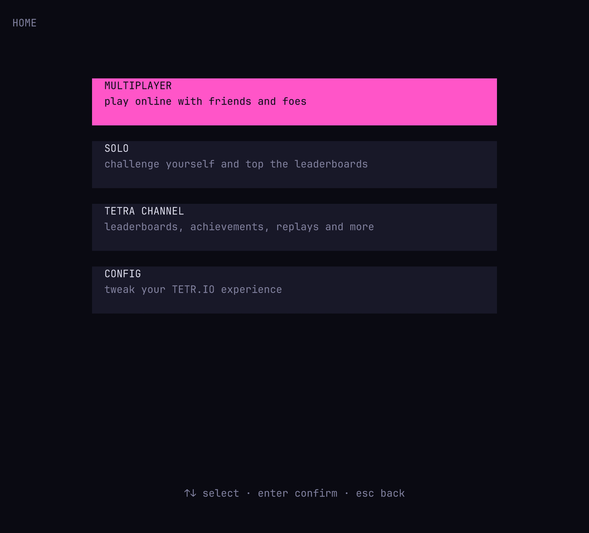

# tetrio-tui

A terminal (TUI) client for **[TETR.IO](https://tetr.io)** — log in with your account and play
**Tetra League**, custom rooms, and solo modes, all rendered in your terminal.

Built from scratch against a reverse-engineered TETR.IO protocol (theorypack = msgpackr, the
Ribbon WebSocket, and the NetCodec game-data binary format), with a TETR.IO-exact local stacker
engine (SRS+ kicks, Park-Miller RNG, exact versus attack/garbage tables).

> ⚠️ **Fair-play & account-safety notice.** TETR.IO's main game API is documented as "not allowed
> without explicit, written consent." This is an *interactive* client for **your own account, played
> by a human** — not an AFK bot (those are banned, and bots can't play League/Quick Play anyway).
> Using any third-party client carries a (small) risk of account action. **Test on an alt account
> first**, and consider asking osk for consent — see [Safety](#safety--terms).

## Features

- **Play Tetra League** ranked duels in your terminal.
- **Custom rooms**: browse public rooms, join, chat, ready up, play & spectate (live opponent boards).
- **Solo modes**: 40 LINES, BLITZ, ZEN, practice (offline, no server).
- **TETRA CHANNEL**: leaderboards (League / XP / AR), global news feed, player profiles.
- **Full menu tree** mirroring the webapp: MULTIPLAYER / SOLO / TETRA CHANNEL / CONFIG.
- **Config** (keybinds, handling, video, audio) persisted to disk, with **TETR.IO config import**.
- Truecolor diff-rendering at 60fps, line-clear / attack / all-clear effects, ghost piece, hold,
  next queue, per-mode stats (APM / PPS / VS).

## Demo



## Install & run

```bash
npm install
npm run build        # -> dist/
npm start            # dist/index.js
# or develop:
npx tsx src/index.ts
```

Log in on the LOGIN screen with your account, or:

```bash
npx tsx src/index.ts --guest            # play as a guest (no League)
npx tsx src/index.ts --token <jwt>      # resume an existing session token
```

**Default controls** (rebindable in CONFIG): `←/→` move, `↓` soft drop, `space` hard drop,
`z`/`x` rotate CCW/CW, `a` rotate 180, `c` hold, `r` reset, `esc` forfeit/back.

## Architecture

```
src/
  net/     theorypack (msgpackr) · ribbon (WS framing/commands/ping/resume) · http api (auth/env/me/ribbon)
           netcodec (bit-level game codec) + structures (boards, pieces, full state, IGE, frames)
           session · client · gameconn (online versus/league orchestration)
  game/    engine (SRS+ kicks, 7-bag Park-Miller RNG, gravity, DAS/ARR, lock delay, garbage,
           attack/combo/b2b/all-clear, T-spins) · localgame (input->frames->server) · state (opponents)
  tui/     renderer (truecolor diff) · driver (ANSI+stdin) · app (screen stack) · screens
           (login, home, menu, game, lobby, league, channel, config)
  config/  persistent config store (keybinds/handling/video/audio + TETR.IO import)
docs/      protocol research: PROTOCOL.md, command_table.json, gamemechanics.md, kicktables.md,
           tetra_channel_api.txt, tetrio_constants.json, and deobfuscated client/capture references.
```

## Protocol notes

- **theorypack** == msgpackr with default options (records/structures on, string bundling off) —
  verified byte-identical to the official client.
- **Ribbon**: WS binary frames `[flags:2|code:6][u24be id?][payload]`; generic channel `code 43`
  carries `u8 command + msgpackr(data)`. Handshake: `new` → `session` → `authorize` → `social.presence`.
- **NetCodec**: the game stream (boards, pieces, full states, in-game events) is a bit-level
  (MSB-first) schema codec riding msgpackr extension types ≥ 10.
- **Login**: `POST /api/users/authenticate` (or `/api/users/anonymousJoin`) → JWT →
  `GET /api/users/me` (+ `X-Connection-ID` = AES-128-CBC of the connection id, key from
  `/api/server/environment`'s `vx`) → `GET /api/server/ribbon` → connect.

See [`docs/PROTOCOL.md`](docs/PROTOCOL.md) for the full write-up.

## Development

```bash
npm run typecheck    # tsc
npm test             # vitest (unit + capture + tui pty snapshots)
RUN_LIVE=1 npm test  # + live-network integration tests (anonymous account)
```

TUI testing uses [`tuistory`](https://github.com/remorses/tuistory) (pty snapshot tests) and
[`ghostty-opentui`](https://github.com/remorses/tuistory) for rendering terminal frames to PNGs.

## Safety & Terms

- This is a **fan-made, unofficial** client. Not affiliated with TETR.IO or osk.
- Playing with a **custom client on your main account has a small risk of action** — test on an
  **alt** first. osk offers API/bot access for projects on Discord.
- The client does **not** forge anti-tamper fingerprints and plays fairly (human inputs).
- Anonymous/guest play can't create rooms or enter Tetra League (server-side rules); a registered
  account is required for those.

## License

MIT. TETR.IO and the TETR.IO logo are property of their respective owners.
